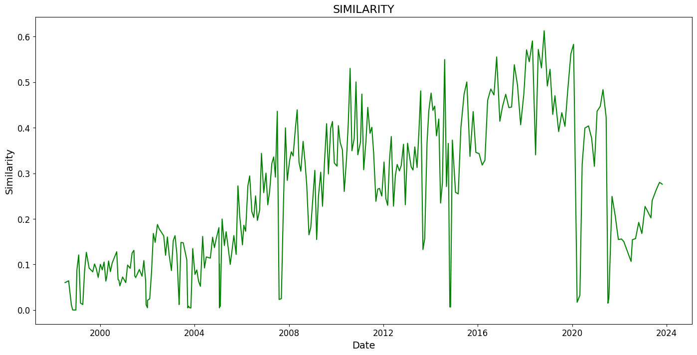

# ECB similarity Research Paper Replication & Exentention

### Terms : 
CAR : Cumulative Abnormal or Excess returns

### Findings & Summary

* Project replicates ECB Introductory Statement text-similarity (1999–2023), linking communication to market reactions.
* Methods: NLP (bigrams Jaccard, LM tone), statement-frequency ΔMRO, macro controls, HAC(6) errors, |CAR| over ±1/±3/±5/±7 days.
* Pre-2014: similarity **increases** with time (convergence), consistent with more templated language.
* Post-2014: similarity **declines** with time (greater novelty), robust to controls and standardization.
* Market impact: tone×similarity **raises** absolute CAR post-2014 (notably at ±7d); tone alone is weak.
* Controls: Output gap and inflation sometimes **dampen** |CAR| post-2014; ΔMRO levels/moves have limited incremental power.
* Bottom line: ECB communication style shifted after 2014, and **tone + novelty** together move markets more than tone by itself.

### Figure 1 — Statement similarity over time

### Figure 2 — The Pessimism measured using the Loughran-Mcdonald dictionnary.

# Results (HAC(6), main |CAR| window ±5d, winsorized 1%)

### Table 3 — Statement similarity vs time (Depvar: `logSimilarity`)

| Sample        | Spec                 | Key regressor  |    Coef |   Sig  |   R²  |
| ------------- | -------------------- | -------------- | ------: | :----: | :---: |
| **1999–2023** | (1) baseline         | logTime_days   |   0.149 |        | 0.001 |
|               | (2) + controls       | logTime_days   |  −0.122 |        | 0.047 |
|               | (4) count + controls | logTime_count  |  −0.113 |        | 0.047 |
| **1999–2013** | (1) baseline         | logTime_days   |   0.724 |  **★** | 0.055 |
|               | (2) + controls       | logTime_days   |   0.426 |        | 0.071 |
|               | (4) count + controls | logTime_count  |   0.488 |    ★   | 0.072 |
| **2014–2023** | (1) baseline         | logTime_days   |  −8.489 | **★★** | 0.059 |
|               | (2) + controls       | logTime_days   | −15.526 | **★★** | 0.109 |
|               | (4) count + controls | logTime_count  | −20.498 | **★★** | 0.104 |

**Takeaway:** Similarity **rose pre-2014** (convergence) but **fell post-2014** (greater novelty).

---

### Table 4 — Market impact (Depvar: `|CAR|_w`, ±5d)

| Sample        | Spec                 | Regressor            |  Coef |   Sig  |   R²  |
| ------------- | -------------------- | -------------------- | ----: | :----: | :---: |
| **1999–2023** | (1) baseline         | pessimism            | 0.148 |        | 0.004 |
|               | (3) interaction only | pessimism×similarity | 0.614 |        | 0.004 |
|               | (4) + controls       | pessimism×similarity | 0.760 |    ★   | 0.034 |
| **1999–2013** | (1) baseline         | pessimism            | 0.176 |        | 0.004 |
|               | (3) interaction only | pessimism×similarity | 1.604 |        | 0.004 |
|               | (4) + controls       | pessimism×similarity | 1.169 |        | 0.035 |
| **2014–2023** | (1) baseline         | pessimism            | 0.296 |    ★   | 0.030 |
|               | (3) interaction only | pessimism×similarity | 0.695 | **★★** | 0.020 |
|               | (4) + controls       | pessimism×similarity | 0.816 | **★★** | 0.058 |

**Window robustness (post-2014):**
±1d: n.s. • ±3d: interaction n.s., **OutputGap −** (p≈.01) • **±7d: interaction +** (p≈.01), **OutputGap −**, **Inflation −**.

**Legend:** ★ p<0.10, **★★ p<0.05** (HAC SEs).

### How we measure **Similarity** and **Pessimism**

**Similarity (statement-to-previous statement)**

* Scope: only the *Introductory Statement* segment (Q\&A and boilerplate trimmed).
* Preprocess: lowercase → strip punctuation → remove English stop-words → **Porter stemmer** → build token list.
* Construct **bigrams** (pairs of consecutive tokens) and take set union per statement.
* Compute **Jaccard similarity** vs the immediately preceding meeting:

  $$
  \text{sim}_t=\frac{|B_t \cap B_{t-1}|}{|B_t \cup B_{t-1}|}
  $$
* Use `logSimilarity = log(max(sim_t, 1e-9))` to stabilize tails for OLS.

**Pessimism (tone of the statement)**

* Tokens: same text segment, but **without stemming** (keeps dictionary words intact).
* Dictionary: **Loughran–McDonald** finance lexicon (Positive/Negative lists).
* Counts: `neg_t = #Negative words`, `pos_t = #Positive words`, `N_t = total tokens`.
* Measure:

  $$
  \text{pessimism}_t = \frac{\text{neg}_t - \text{pos}_t}{N_t}
  $$
* Used directly and in the interaction **pessimism × similarity**; standardized (z-scored) in some specs.

**Reference:** Amaya & Filbien (2015), *Journal of Financial Markets*. [ScienceDirect link](https://www.sciencedirect.com/science/article/pii/S1544612314000877)
